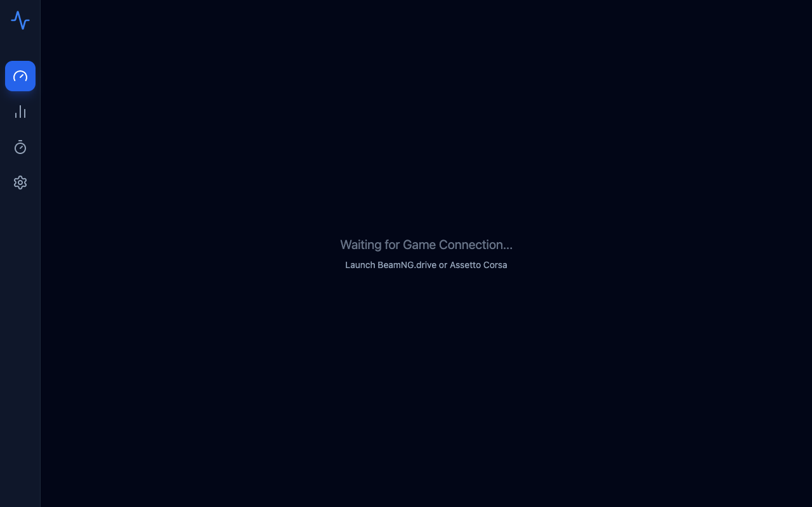
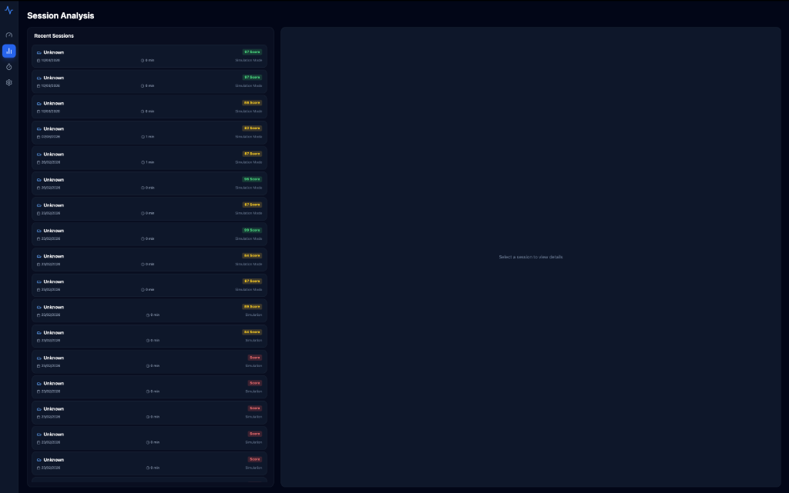
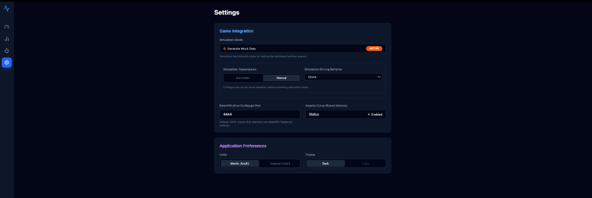

# Driving Simulation Telemetry Dashboard

An advanced, real-time vehicle telemetry dashboard built using **Electron**, **React**, **TypeScript**, and **Vite**.

This application connects to racing simulators (or runs natively with a built-in Browser Simulator fallback) to visualize complex driving physics dynamics mathematically. It includes real-time track mapping, G-force friction circles, input behavior analysis, and precision data logging.


## Pages & Features

### 1. The Dashboard (`/`)


The main hub of the application. It visualizes live, high-frequency telemetry data stripped from racing simulators (or the built-in browser engine) to analyze current vehicle dynamics.

- **Live Traces**: A dynamic multi-graph plotting real-time Speed, RPM, Throttle (%), and Brake (%).
- **Friction Circle**: An active G-Force mapping component displaying longitudinal and lateral stress limits (Max 2.5G).
- **Vehicle Health**: Live degradation monitors for the Engine, Transmission, Suspension, Brakes, and Aerodynamics.
- **Session Extremes**: Automatically tracks and holds peak values like maximum Speed, average Throttle utilization, and peak G-Forces over the current run.
- **Track Mapper**: Generates a live top-down map of the vehicle's position.

### 2. Telemetry Analysis (`/analysis`)


The historical post-session deep dive page built for engineers and mechanics.

- **CSV Log Uploads**: Upload previous driving runs (exported from the Dashboard) for deep visual scrutiny.
- **Timeline Filtering**: Scrub through historic data visually to isolate precise corners or accidents.
- **Lap Comparison**: Overlay runs to compare braking points and throttle application differences between laps or distinct driver behaviors.

### 3. Reaction Test (`/reaction`)


A built-in cognitive training tool intended for driver warm-ups before hitting the simulator.

- **Start Lights Simulation**: Mimics standard Formula 1 red-light starting sequences on a randomized hold timer.
- **Reflex Tracking**: Accurately measures jump-starts, false reactions, and milli-second true reaction times upon light extinguishment.

### 4. Settings Configuration (`/settings`)


The application control center.

- **Connection Bridge**: Manage live data feeds from supported simulators (Assetto Corsa, BeamNG).
- **Simulation Mode**: A native browser physics fallback that generates mock telemetry without requiring a heavy game to test the dashboard. Includes mock behavior states (e.g., Professional Driver, Drunk, Reckless) to watch the gauges react differently.

---

## 🏁 Game Support & Setup

### BeamNG.drive (High-Fidelity)
To enable detailed **Tire Thermals** and **Vehicle Health** in BeamNG:
1. Copy `electron/game-connectors/beamng/telemetry.lua` from this project to your BeamNG user folder: 
   `%USERPROFILE%\AppData\Local\BeamNG.drive\<version>\scripts\vehicle\extensions\telemetry.lua`
2. In-game, open the console (`~`) and type: `v.extensions.load('telemetry')`
3. The dashboard will automatically detect the high-fidelity stream on Port 4440.
4. Ensure OutSim (Port 4442) and OutGauge (Port 4444) are also enabled in BeamNG Gameplay settings for full physics support.

### Assetto Corsa
Requires Shared Memory access (Windows only). Currently in development.

---

## Installation & Setup

Before starting, ensure you have [Node.js](https://nodejs.org/) (version 18+ recommended) and Git installed on your system.

### Step 0: Get the Files

First, you need to download the source code from GitHub. Open your terminal or IDE (like VSCode) and run:

```bash
git clone https://github.com/abdullah-binmadhi/Driving-Simulation-Telemetry-Dashboard-Application.git
cd Driving-Simulation-Telemetry-Dashboard-Application
```

### Option 1: Development Server (Browser or Live Mock)

If you just want to run the React interface without compiling the desktop application:

```bash
# Install all required dependencies
npm install

# Run the Vite React UI locally (Starts at http://localhost:5173/)
npm run dev:ui
```

*Note: To simulate live car telemetry in the browser without launching a heavy game, navigate to the Dashboard's **Settings** (gear icon) and toggle **"Simulation Mode"**.*

### Option 2: Build the Native Desktop Application

If you want to compile the overarching Electron project to a system-native executable:

1. **Install Dependencies:**

   ```bash
   npm install
   ```

2. **Build for macOS (Apple Silicon / Intel):**

   ```bash
   npm run build
   ```

   By default, this compiles the TypeScript, bundles Vite, and uses `electron-builder` to package the app. Once finished, navigate to the newly generated `dist-app/` folder. You will find a ready-to-use `.dmg` installer and a `.app` file tailored for macOS.

3. **Build for Windows:**
   On a Windows machine, the identical build command triggers the `nsis` Windows target inside `package.json`:

   ```bash
   npm run build
   ```

   Check the `dist-app/` folder for the freshly built Windows `.exe` installer.

---

## How to Record & Download Telemetry Data

The dashboard includes a highly compressed Data Logger that filters duplicate millisecond timings and truncates excessive float precision down to 2 decimal places to minimize file bloat.

**Data Export Workflow:**

1. Connect to a valid telemetry source (or enable **Simulation Mode** in the settings).
2. Locate the **"Data Logger (To DB)"** widget on the left side of the Dashboard.
3. Click **Start Rec**. The widget will pulse red and begin aggregating frame arrays.
4. Drive! Data is continuously written into the local SQLite memory pool.
5. When finished, click **Stop Rec**.
6. A new button will glow blue: **Export CSV**. Click this button.
7. The system's native OS *Save Dialog* will appear. Choose where you want to download `session-[ID].csv` to your computer.

The exported `.csv` document scales your inputs (Throttle/Brake/Clutch) mathematically into 0-100 percentages, ready for immediate spreadsheet import.
